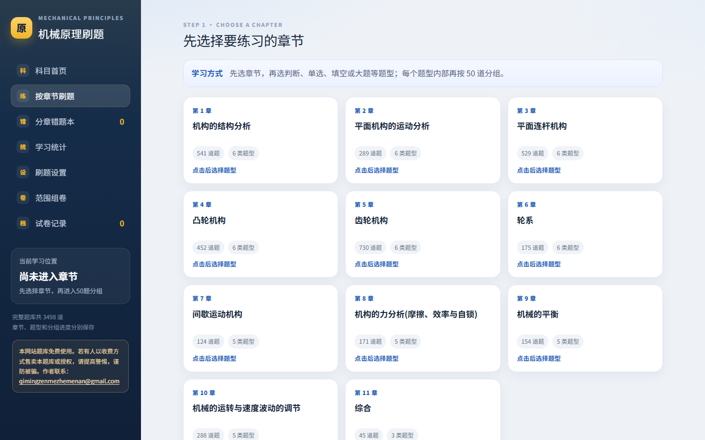

  

<h1 align="center">机械刷题中心</h1>

  <strong>机械原理</strong> · <strong>机械设计</strong> 双科目在线刷题 
  分章练习 · 错题本 · 模拟组卷 · Word 导出 · 多设备同步

  <a href="https://mechanicaldesign.online"><strong>▶ 在线使用</strong></a>

## 📚 题库内容

| 科目 | 章节 | 题量 |
|---|---|---|
| 机械原理 | 11 章 | 3498 题 |
| 机械设计 | 14 章 | 3088 题 |

题型覆盖判断、单选、多选、填空、简答、大题，题目配有题图与答案图。

## ✨ 功能

- **分章练习** — 按章节 / 题型 / 每 50 题分组进入，题目列表一键跳题，进度自动保存
- **错题本** — 答错自动收录，按章节回顾，支持标记"掌握 / 模糊 / 不会"
- **模拟组卷** — 期末模拟卷 / 单元卷，自定义章节与题型范围，大题按考察方向与知识点分散智能选题
- **试卷导出** — 一键导出 Word 文件（含题图），打印练习更方便
- **学习统计** — 各章练习量、正确率一目了然
- **记录迁移** — JSON 文件导入导出，跨设备同步码互导学习记录

## 🖥️ 界面

| 科目首页 | 章节练习 |
|---|---|
|  |  |

## 📖 使用说明

1. 打开[网站](https://mechanicaldesign.online)，选择科目进入
2. 左侧栏切换：章节练习、错题本、模拟组卷、统计、设置
3. 学习进度自动保存在当前浏览器中，换设备可用同步码或记录文件迁移
4. 手机浏览器同样可用，建议"添加到主屏幕"方便日常使用

---

题库内容仅供个人学习交流使用

